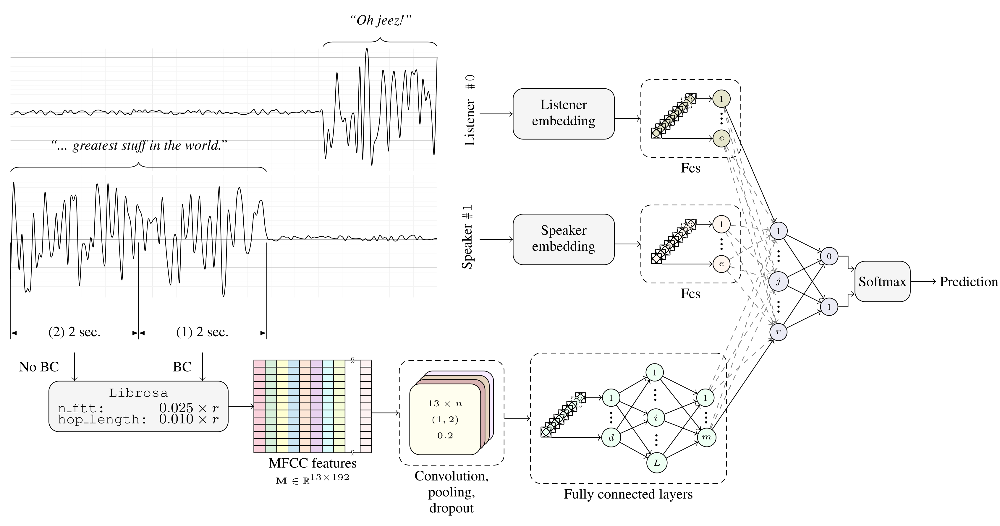
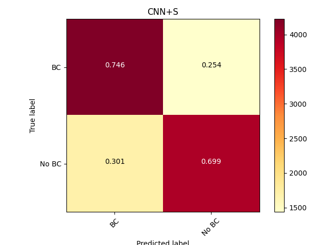
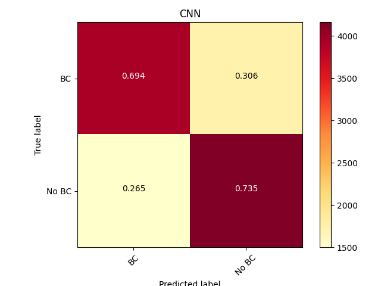
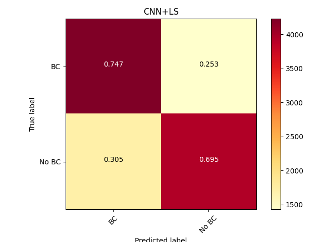

Introduction
============

In day-to-day conversations, speakers elicit feedback responses like
*yeah, uh-huh* and *oh!* from listeners through subtle verbal cues.
These responses are termed backchannels (BC), and the cues by speakers
are frontchannels (FC) . BC responses can also be non-verbal, and
usually indicate that the listener is still following and participating
in the conversation, while the speaker contributes the bulk of the
conversation. Thus, BCs and FCs constitute important parts of dialogue
and turn-taking, in that they allow conversation to flow naturally .

Given the salience of this linguistic phenomenon in conversation, spoken
dialogue systems could interact with users in more natural and intuitive
ways by modeling backchanneling behaviours, thus making these systems
more successful in conversation . With this in mind, we train a model
that predicts instances in dialogue that could evoke BC responses by
finding patterns in the acoustic data of FCs, specifically in extracted
Mel-frequency cepstral coefficients (MFCC). Additionally, we incorporate
representations of both speaker and listener in the form of embeddings
to test whether modeling each speakers’ behavior at the time of
eliciting BCs improves the accuracy of our model.

What follows is a brief overview of previous work done in backchannel
prediction in Section
<a href="#sec:background" data-reference-type="ref" data-reference="sec:background">2</a>
and
<a href="#sec:backchan" data-reference-type="ref" data-reference="sec:backchan">3</a>,
followed by a description of our data and model(s) in Section
<a href="#sec:exp" data-reference-type="ref" data-reference="sec:exp">4</a>.
Results are reported in Section
<a href="#sec:results" data-reference-type="ref" data-reference="sec:results">5</a>
and are discussed and analyzed in Section
<a href="#sec:discAnalys" data-reference-type="ref" data-reference="sec:discAnalys">6</a>,
ending with concluding remarks in Section
<a href="#sec:conc" data-reference-type="ref" data-reference="sec:conc">7</a>.

Background
==========

Previous work that considers acoustic data for backchannel prediction
includes that of Ruede et al. , who used a feed-forward neural network
in conjunction with a long-short term memory neural network (LSTM) to
predict backchannels. Work preceding this had never used a neural
approach to modelling backchanneling behaviour, but was restricted to a
rule-based approach. Therefore, their approach was novel. As features to
their model they used pitch, power, fundamental frequency variation
(FFV) and Mel-frequency cepstral coefficients (MFCCs). The use of MFCC
features in conjunction with pitch seemed to be redundant, seeing as the
MFCC and pitch features contribute similar information and so the
combination of these did not improve the model.

Ruede et al. went on to incorporate word embeddings using Word2Vec as a
linguistic feature, which improved the model significantly.

The current study does not aim to incorporate any linguistic data, but
instead investigates the degree to which speakers and listeners
themselves present idiomatic patterns of behaviour within language.
Ortega et al. used listener embeddings in order to capture the
backchanneling behaviours of listeners, seeing as the backchannel
prediction model should mimic the behaviour of listeners. Similarly, our
model uses listener embeddings to predict backchannels, but goes beyond
this to incorporate speaker embeddings that model the behaviours of
speakers, as these are the behavioural patterns provided by speakers
that elicit backchannels and should thus be useful to the model as well.

Backchannel Prediction
======================

Research shows that there are different kinds of BCs such as continuers
and assessments , as well as BCs that are positive, negative and
questioning, among many others . In our work, we do not make any
distinction between different kinds of BCs and simply predict whether an
instance within a conversation would evoke a BC or not.

Our BC prediction baseline model, as shown in Figure
<a href="#fig:scheme" data-reference-type="ref" data-reference="fig:scheme">[fig:scheme]</a>,
consists of a Convolutional Neural Network (CNN) followed by a dense
feedforward neural network (FNN) that produces a vector representation
of the MFCC features. We add two separate embedding layers to the CNN
baseline, one that encodes listener behaviour and another that encodes
speaker behaviour. The rationale behind this is that the model should
glean patterns of behaviour from both the listener and speaker in order
to improve its prediction of BC and No BC instances.

At prediction time, the input to these embedding layers is a single
integer that uniquely identifies the speaker/listener, and respectively
outputs a vector representation. These representations (if embeddings
are used) are joined by concatenation and fed through a final Softmax
layer in order to make the prediction *BC* or *no BC*.

Experimental Setup
==================

This section describes the dataset, extraction of data and experiments
performed on five different models: the baseline CNN model, the baseline
CNN with delta/delta-delta (DD) features, the baseline with speaker
embeddings, the baseline with listener embeddings, and finally the
baseline with both speaker and listener embeddings.

Dataset
-------

In our experiments we used the time-aligned word-transcribed dialog
corpus Switchboard , consisting of about 250 hours of speech, and a
total of 2,500 phone conversations by 500 American speakers. Binary
annotations and data splits were taken directly from Ortega et al. ,
which includes 60,870 BC and No BC samples distributed across 2,000
conversations for training, 238 conversations for validation and 200
conversations for testing. The conversations are stored in individual
14-bit wave files with sampling rates of *r* = 8000, where each
participant of the conversation is assigned one of the two available
stereo channels. Additionally, the dataset includes unique speaker ids,
suitable for building the representations of speakers and listeners.

Extraction
----------

As mentioned in Section
<a href="#sec:backchan" data-reference-type="ref" data-reference="sec:backchan">3</a>,
our model is fed two sources of information, namely acoustic features
and speaker/listener indexes.

On the one hand, the acoustic features are retrieved directly from the
digitized conversations using the python library `librosa 0.8.0` , a
multipurpose package for music and audio analysis. The extraction scheme
is reflected in the left-hand side of Figure
<a href="#fig:scheme" data-reference-type="ref" data-reference="fig:scheme">[fig:scheme]</a>.
In it, a cutout of one telephone conversation available the Switchboard
corpus can be seen. The frontchannel (“... greatest stuff in the world”)
is divided into two chunks according to the dataset annotations: (1) the
last two seconds uttered by the speaker before the listener backchannels
(i.e. the backchannel cue) and (2) any other 2-second piece of
non-overlapping speech, ideally two seconds before the aforementioned
backchannel cue.

Such speech cutouts are forwarded to `librosa` in order to extract MFCC
features, which capture the macro-structure (vocal tract configuration
of the speaker and formants) and the micro-structure (fundamental
frequency) of the audio spectrum. MFCC coefficients are extracted in
frames of 25 ms and with a 10 ms shift, assuring a small degree of
overlap between them. Given this particular configuration, the acoustic
features for two seconds of audio result in a matrix
**M** ∈ ℝ13 × 192, where the number of rows and columns
indicate the number of MFCC coefficients for each frame and the total
number of frames, respectively.

Additionally, delta velocity features and delta-delta acceleration
features have been also extracted due to their potential to improve the
overall performance of our backchannel predictor. These features are
used in training the delta-CNN model only.

On the other hand, the representations of listeners and speakers is
carried out through two embedding layers which are accessed through
indexes or IDs. Each lookup table is consulted by an intermediate
speaker ID constructed during the extraction of the acoustic features.
This intermediate speaker ID is necessary since some channels of the
corpus are not annotated and thus discarded. Speaker IDs uniquely
identify all the participants of the conversations across the whole
corpus.

Therefore, the model takes as input the above mentioned speaker IDs as
well as acoustic information for each instance.

Training and Testing
--------------------

This section describes in more detail all five models for backchannel
prediction: (1) CNN, (3) delta-CNN, (3) CNN+L, (4) CNN+S, and (5)
CNN+LS.

<figure>
<figcaption>Complete model architecture using acoustic features and speaker/listener embeddings.</figcaption>
</figure>

The first baseline model consists of a CNN fed by acoustic features. The
MFCC coefficients are passed through a convolutional layer of *n*′
output channels (filters) using a kernel of variable width 13 × *n*.
Fixing the height of the kernel to 13 forces its movement to be in the
same direction as the time, preventing it to swipe in the direction of
the MFCC features. Pooling and dropout layers also play a role in the
convolutional layer. The resulting convolution over the MFCC features is
a row vector which can be directly forwarded to the fully connected
layers. Finally, a softmax classification is performed to predict
whether this instance should elicit a backchannel or not.

The second baseline model (delta-CNN) is set up the same way as the
first baseline model described above, except that delta velocity
features and delta-delta acceleration features are passed to the model
as input in addition to the MFCC features. This also means that the
input to the CNN is a 3-channel tensor, therefore the filters are
applied individually for each channel before being flattened and passed
to the dense layers later on.

The third baseline (CNN+L) adds to the CNN architecture the
representation of each listener through embeddings. The dimensionality
of the listener embedding is preferred to be small to avoid overfitting
and regularization problems, and is followed by a rather narrow fully
connected layer of the same size. The embedding representation and the
output of the fully connected layers of the CNN are concatenated, to be
finally passed through another fully connected layer just before the
softmax classification.

Similarly, the fourth baseline model (CNN+S), sets up a five-dimensional
embedding to represent the speakers, with the rest of the model as
described for the CNN+L model.

<table>
<caption>Hyperparameters explored by a grid-search.</caption>
<thead>
<tr class="header">
<th style="text-align: left;"><strong>Parameter</strong></th>
<th style="text-align: left;"><strong>Setting</strong></th>
</tr>
</thead>
<tbody>
<tr class="odd">
<td style="text-align: left;">Filter widths (<em>n</em>)</td>
<td style="text-align: left;">5, 8, 11, 14, 17, 20</td>
</tr>
<tr class="even">
<td style="text-align: left;">Number of filters (<em>n</em>′)</td>
<td style="text-align: left;">8, 16, 32</td>
</tr>
<tr class="odd">
<td style="text-align: left;">Dropout rates</td>
<td style="text-align: left;">0.3, 0.4, 0.5</td>
</tr>
<tr class="even">
<td style="text-align: left;">Activation function</td>
<td style="text-align: left;">ReLU</td>
</tr>
<tr class="odd">
<td style="text-align: left;">Pooling size</td>
<td style="text-align: left;">(1, 2)</td>
</tr>
<tr class="even">
<td style="text-align: left;">Batch size</td>
<td style="text-align: left;">64, 128, 256</td>
</tr>
<tr class="odd">
<td style="text-align: left;">Learning rates</td>
<td style="text-align: left;">0.001, 0.0001, 0.00001</td>
</tr>
<tr class="even">
<td style="text-align: left;"># fully connected layers</td>
<td style="text-align: left;">3, 4</td>
</tr>
<tr class="odd">
<td style="text-align: left;">Fully connected layers width</td>
<td style="text-align: left;">64, 128, 256</td>
</tr>
<tr class="even">
<td style="text-align: left;">Optimizer</td>
<td style="text-align: left;">Adam</td>
</tr>
<tr class="odd">
<td style="text-align: left;">Loss function</td>
<td style="text-align: left;">MSE</td>
</tr>
</tbody>
</table>

Finally, the latter baseline (CNN+LS) combines both the representation
of the speakers and the listeners simultaneously. In this sense, both
embeddings are concatenated to the output of the CNN and then forwarded
to another fully connected layer just before the final prediction. This
full architecture is the one shown in Figure
<a href="#fig:scheme" data-reference-type="ref" data-reference="fig:scheme">[fig:scheme]</a>.
Note that the rest of baselines can be also visualized by removing the
correspondent module in the scheme.

As a final remark, it is worth noting that the width and depth of the
feed-forward neural network, as well as the CNN filters, pooling sizes
and dropout layers varies accordingly to the configuration used. Table
<a href="#tab:grid-search-cnn" data-reference-type="ref" data-reference="tab:grid-search-cnn">1</a>
collects all the configurations that have been explored as part of a
comprehensive grid-search during training for all the five baseline
models.

The networks have been executed on `pytorch 1.5.0`, `python 3.8.3` and
two different machines consisting of a six-core 12-thread 9th generation
Intel Core i7 microprocessor at 2.60 GHz, 16 GB of RAM, and a Nvidia GTX
1650 GPU with 4 GB of GDDR5 global memory running archlinux 1.4; and 2
20-core Intel Xeon E5-2650 v4 at 2.20GHz, 256 GB of RAM, and 4 GeForce
GTX TITAN X with 12 GB of GDDR5 memory running Fedora 32.

Results
=======

Table
<a href="#tab:finalHyp" data-reference-type="ref" data-reference="tab:finalHyp">2</a>
shows the hyperparameters that result in the highest accuracy scores for
the models. The results for all five models running on these
hyperparameters are reported in Table
<a href="#tab:resAcc" data-reference-type="ref" data-reference="tab:resAcc">3</a>.

<table>
<caption>Hyperparameters of reported results.</caption>
<thead>
<tr class="header">
<th style="text-align: left;"><strong>Parameter</strong></th>
<th style="text-align: left;"><strong>Setting</strong></th>
</tr>
</thead>
<tbody>
<tr class="odd">
<td style="text-align: left;">Filter width (<em>n</em>)</td>
<td style="text-align: left;">8</td>
</tr>
<tr class="even">
<td style="text-align: left;">Number of filters (<em>n</em>′)</td>
<td style="text-align: left;">16</td>
</tr>
<tr class="odd">
<td style="text-align: left;">Dropout rates</td>
<td style="text-align: left;">0.3, 0.4, 0.5</td>
</tr>
<tr class="even">
<td style="text-align: left;">Activation function</td>
<td style="text-align: left;">ReLU</td>
</tr>
<tr class="odd">
<td style="text-align: left;">Pooling size</td>
<td style="text-align: left;">2</td>
</tr>
<tr class="even">
<td style="text-align: left;">Batch size</td>
<td style="text-align: left;">128</td>
</tr>
<tr class="odd">
<td style="text-align: left;">Learning rate</td>
<td style="text-align: left;">0.0001</td>
</tr>
<tr class="even">
<td style="text-align: left;"># fully connected layers</td>
<td style="text-align: left;">3</td>
</tr>
<tr class="odd">
<td style="text-align: left;">Fully connected layers width</td>
<td style="text-align: left;">64/128</td>
</tr>
</tbody>
</table>

<table>
<caption>Global results (%). </caption>
<thead>
<tr class="header">
<th style="text-align: left;"><strong>Model</strong></th>
<th style="text-align: left;"><strong>Precision (%)</strong></th>
<th style="text-align: left;"><strong>Recall (%)</strong></th>
<th style="text-align: left;"><strong>Accuracy (%)</strong></th>
</tr>
</thead>
<tbody>
<tr class="odd">
<td style="text-align: left;">CNN</td>
<td style="text-align: left;">70.63</td>
<td style="text-align: left;">73.51</td>
<td style="text-align: left;">71.47</td>
</tr>
<tr class="even">
<td style="text-align: left;">delta-CNN</td>
<td style="text-align: left;">70.41</td>
<td style="text-align: left;">73.67</td>
<td style="text-align: left;">71.36</td>
</tr>
<tr class="odd">
<td style="text-align: left;">CNN+L</td>
<td style="text-align: left;">73.43</td>
<td style="text-align: left;">69.61</td>
<td style="text-align: left;">72.21</td>
</tr>
<tr class="even">
<td style="text-align: left;">CNN+S</td>
<td style="text-align: left;">73.39</td>
<td style="text-align: left;">69.92</td>
<td style="text-align: left;"><strong>72.28</strong></td>
</tr>
<tr class="odd">
<td style="text-align: left;">CNN+LS</td>
<td style="text-align: left;">73.35</td>
<td style="text-align: left;">69.54</td>
<td style="text-align: left;">72.13</td>
</tr>
</tbody>
</table>

Although the variance in accuracy scores between the different models is
marginal, the highest accuracy is achieved by the model using speaker
embeddings and MFCC features. Unexpectedly, the model using both speaker
and listener embeddings performs worse than the models using only
speaker or listener embeddings.

As far as the use of DD features is concerned, our reported results show
that they do not improve the accuracy of the model, and in fact performs
worse than the baseline CNN with only MFCC features.

Finally, it can be seen that in terms of precision/recall the embeddings
reduce the overall recall down to around 3 percentage points in favor of
a boost in the precision, having a positive impact in the overall
accuracy.

Discussion and Analysis
=======================

Discussion
----------

As shown in Table
<a href="#tab:resAcc" data-reference-type="ref" data-reference="tab:resAcc">3</a>,
all three models that use embeddings achieve higher accuracy scores than
the baseline CNN model. Additionally, the results show that the best
performing model consists of the baseline with speaker representations,
where the model is trained on the MFCC features and uses speaker
embeddings to make its predictions. This builds on the findings of
Ortega et al. , where listener embeddings consistently improve their
model’s results, whether it is trained on acoustic features or lexical
features. Our results show that speaker embeddings can make the same
improvements, perhaps to a greater degree.

On the one hand, the idea behind using speaker embeddings is that they
model the behaviour of the interlocutor and represent patterns in cues
that may elicit backchannels. Intuitively, the finding that the model
scores better results when using speaker representations is thus
plausible in that the model is trying to learn the patterns in speech by
the speaker. Perhaps some speakers leave more room for backchannels,
while others less so. Furthermore, it is worth noting that this
procedure might not generalize to speakers not included in the training
dataset, as they are not captured by any specific embedding. In this
situation, an unknown speaker will yield a noisy embedding, therefore
masking this model’s superiority when only known speakers are tested.

On the other hand, the idea of also including listener embeddings is
similar to the speaker embeddings. Listener may elicit backchannel
differently depending on their individual traits, such their current
mood, their general behavior, personality, as well as its will to
interact with the speaker at a given moment. Some of these features may
change over time (e.g. current mood), resulting in features that may end
up being noisier than those of the speaker embeddings. Also note that
listener embeddings also suffer from the same generalization problems as
the speaker embeddings.

The results also show that a combination of speaker and listener
representations does not lead to better results than using only one
representation for the CNN, be it speaker or listener. One of the
reasons why the combination of speaker and listener embeddings is not
yielding better results than themselves alone could be that the model is
trying to learn by hard combinations of speaker/listeners. As the the
number of combination of speaker/listeners is high, but the number of
samples for each combination is low, we end up having a model with too
many parameters and too little training data, resulting in lower
performance. We also have to consider that, on top of this, those
combinations of speaker/listener embeddings not seen during training
have a degree of penalty in performance in our development and test
data.

Finally, the model using the DD features shows the lowest performance
overall. One possible explanation for this phenomenon is that we might
be running on underfitting problems. It is possible that the number of
parameters of our model, specifically the dense layers after the
convolutional layers, is not enough to fully capture the potential of
the DD features. In contrast, it can also be possible that the DD
features would not provide any further information beyond the MFCC
features, as they are function of them. In this sense, theoretically,
NNs would be able to project such MFCC features into a higher
dimensional space by optimization, and retrieve DD features by
themselves in case those were any advantageous.

Analysis
--------

<figure>
<figcaption>Normalized confusion matrix for CNN+S model</figcaption>
</figure>

<figure>
<figcaption>Normalized confusion matrix for CNN+L model</figcaption>
</figure>

Figure
<a href="#fig:confCNN-S" data-reference-type="ref" data-reference="fig:confCNN-S">1</a>
and
<a href="#fig:confCNN-L" data-reference-type="ref" data-reference="fig:confCNN-L">2</a>
and provide a glimpse into the classification decisions the CNN+S and
CNN+L models made when achieving 72.28% and 72.21% accuracy
respectively.

The CNN+S model is able to classify 74.6% of instances where a
backchannel should happen correctly. It does not fare so well with
regard to instances that should not elicit a backchannel. In other
words, the CNN+S model overzealous in predicting BC in No BC instances
and therefore does not detect No BC instances as well as it does BC
instances. Perhaps in future the model could be improved by introducing
a weighting or threshold that increases the likelihood of No BC
predictions.

The CNN+L (Figure
<a href="#fig:confCNN-L" data-reference-type="ref" data-reference="fig:confCNN-L">2</a>)
and CNN+LS (found in Appendix
<a href="#app:appConf" data-reference-type="ref" data-reference="app:appConf">8</a>
Figure
<a href="#fig:confCNN-LS" data-reference-type="ref" data-reference="fig:confCNN-LS">4</a>)
models each have very similar confusion matrices to that of the CNN+S
model. In contrast, the CNN baseline seems to under-predict
backchanneling instances, as seen in Appendix
<a href="#app:appConf" data-reference-type="ref" data-reference="app:appConf">8</a>
Figure
<a href="#fig:confCNN" data-reference-type="ref" data-reference="fig:confCNN">3</a>.
Specifically, the CNN model more is good at detecting No BC instances
(73.5% correct), but is not as good at detecting BC instances (69.4%
correct). This pattern is reversed in the models that include
speaker/listener representations.

On the whole, it seems that the use of listener and/or speaker
representations leads to higher precision at the cost of lower recall
(see Table
<a href="#tab:resAcc" data-reference-type="ref" data-reference="tab:resAcc">3</a>).
This could be favorable in the context of participating in dialogue,
since too many BC responses by a participant might disrupt and impair
the natural flow of conversation.

Conclusion
==========

In this work we compared five different backchannel predictors on the
Switchboard benchmark dataset. We set up a baseline consisting of a CNN
fed with MFCC features extracted from digitized phone conversations.
Aiming to capture the behavior of participants in conversations, we
added on top of our baseline their representations through speaker and
listener embeddings. Furthermore, we considered including speed and
acceleration MFCC coefficients to fully exploit the potential of
acoustic features for backchaneling. The results show that
listener/speaker embeddings improve the overall accuracy of our baseline
the predictor in favor of a higher precision and a toll in recall, being
the baseline using speaker embeddings the most powerful one. The
experiments have also indicated that delta/delta-delta MFCC features
resulted to be irrelevant for BC modeling in our specific set-up.

Appendix: Confusion Matrices
============================

<figure>
<figcaption>Normalized confusion matrix for CNN model.</figcaption>
</figure>

<figure>
<figcaption>Normalized confusion matrix for CNN+LS model.</figcaption>
</figure>
